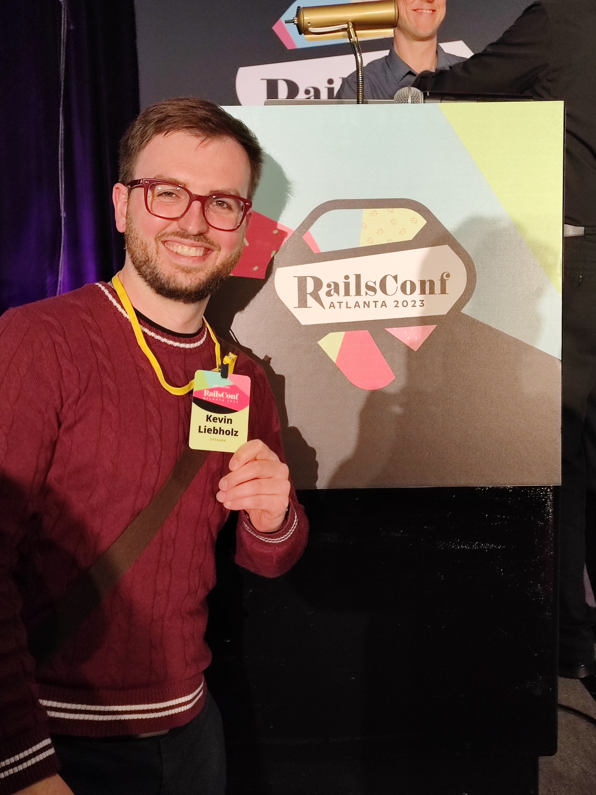
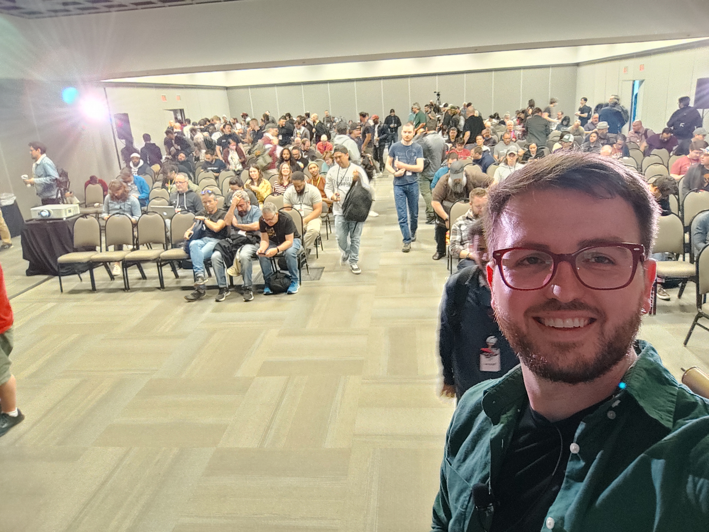

{:width="300px"}

I am an experienced **creator**, **full-stack developer**, and **strategist** with a passion for incorporating new technologies. With a **strong entrepreneurial background** and expertise in both **back-end** and **front-end** development, I am equipped to bring innovative ideas to life.

My goal is to shape a better, more **sustainable** future by leveraging technology and a customer-centric approach. I thrive on supporting remarkable projects and businesses that make a positive impact.

Browse through my portfolio to explore my diverse range of experience and get a glimpse into the exciting possibilities that can be achieved through my skills and expertise.

## I just spoke at RailsConf 2023 Atlanta!
Topic: *Exploring the Power of Turbo Streams & ActionCable*

{:width="300px"}

This was one of my greatest achievements so far. Speaking in front of around 350 developers about a very interesting topic. Hopefullt, the video comes out soon. Until then, here is the plot:

*Dive into the world of Turbo Streams and ActionCable with the Dragon Rider Eragon and his majestic dragon, Saphira, as we build a real-time tic-tac-toe game. We will utilize Turbo Stream broadcasting and ActionCable customization to create the game for our heroes, adding constraints of rising difficulty one after the other. Are you an advanced coder? Or are you a beginner? As long as you are looking to explore new applications of Hotwire’s Turbo or simply learn about it, we’re a match!*

{:width="300px"}
